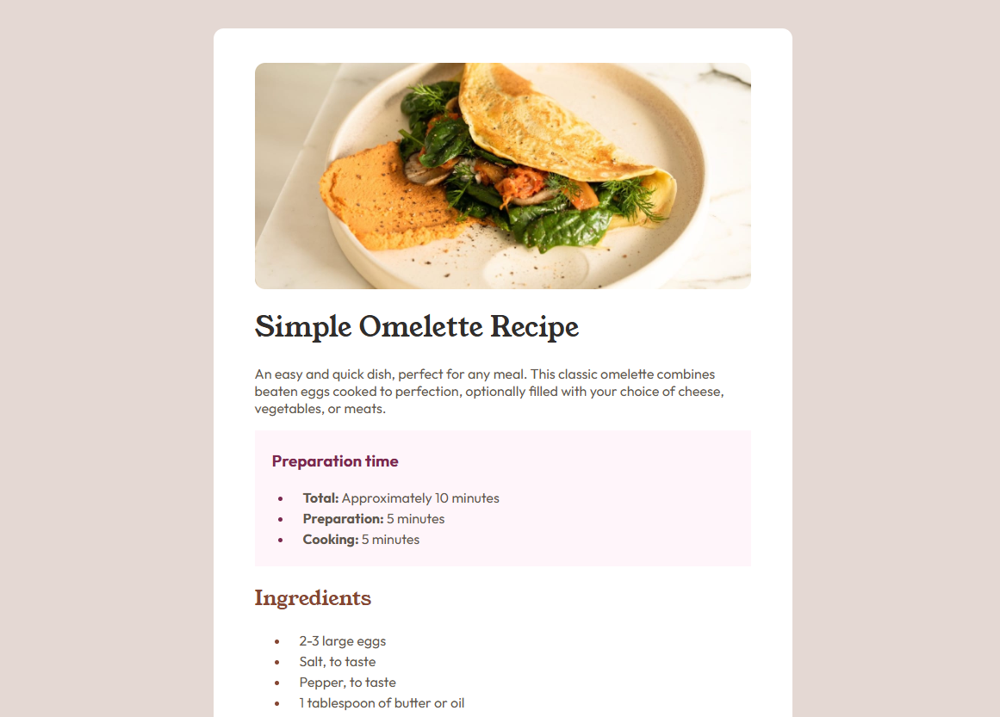

# Recipe Page Main

This Recipe Page Main is a project completed through one of the many challenges that can be found on the [Frontend Mentor](https://www.frontendmentor.io) platform.

🔗 [See project live](https://pmendezpe.github.io/frontendmentor-recipe-page-main/)

## 🚀 Technologies

- HTML
- CSS

## ✨ Characteristics

- Responsive design with Mobile First
- Use of flexbox for layout
- Use of relative units for greater flexibility and accessibility
- Best practices in accessibility (alt, loading="lazy")

## 👨‍💻 Author

[pmendezpe](https://github.com/pmendezpe)